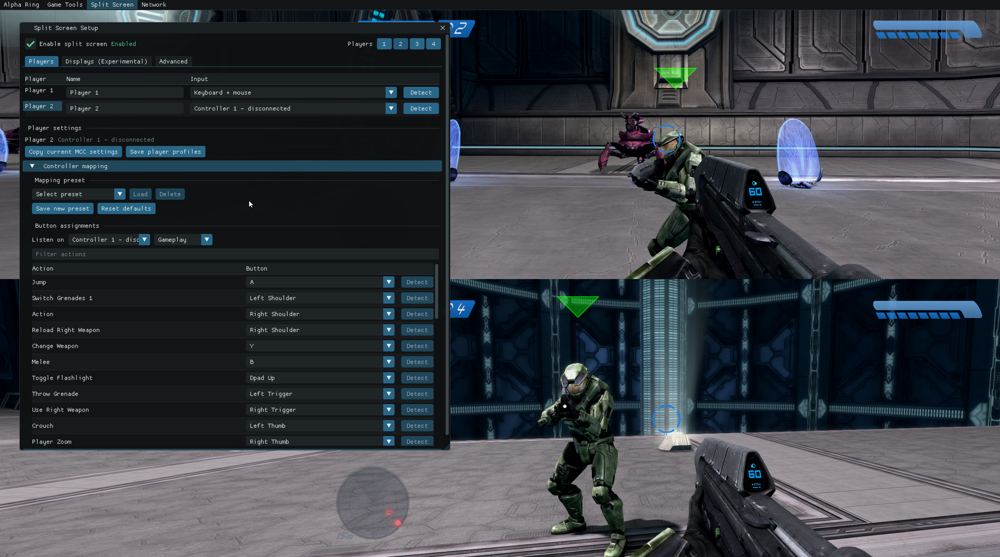

# AlphaRing - Proton and Dual-Monitor Fork

AlphaRing is an experimental modding and local split-screen tool for the Steam version of Halo: The Master Chief Collection. This fork focuses on Proton compatibility, reliable player input assignment, a clearer in-game interface, and an experimental two-monitor output mode for Halo: Combat Evolved.

> This is an improvement fork, not a new original project. AlphaRing was created by [WinterSquire](https://github.com/WinterSquire/AlphaRing), with important work inherited through the [thejackbitt fork](https://github.com/thejackbitt/AlphaRing) and [kirklandsig fork](https://github.com/kirklandsig/AlphaRing). See [Credits](#project-lineage-and-credits) for the full lineage.

**[Download the latest AlphaRing release](https://github.com/miguelsilva5989/AlphaRing/releases/latest)**

## Showcase

### New in This Fork: Redesigned Split-Screen Setup



**This is the new interface added by this fork.** It combines player and input assignment, controller detection, searchable button mapping, profile controls, and the experimental split-screen output workflow in one setup window.

## Status

This branch currently targets:

- Steam MCC build `1.3528.0.0`
- Windows 10/11 or Linux through Steam Proton
- MCC launched with anti-cheat disabled
- XInput-compatible controllers

The normal AlphaRing split-screen functionality remains available across MCC titles. The new native dual-monitor renderer is narrower: it is currently intended for two-player Halo CE campaign using classic graphics.

## Highlights

- Local MCC split-screen inherited from AlphaRing
- Player 1 keyboard and mouse support
- Explicit `Keyboard + mouse`, controller, and `Not assigned` input states
- Controller auto-detection with duplicate-assignment protection
- Searchable gamepad mapping editor and reusable mapping presets
- Reorganized player profiles and a modernized ImGui interface
- Readiness diagnostics plus explicit Apply and Revert controls
- Native keyboard and controller navigation in the overlay
- Linux/Proton DLL loading and MinGW build support
- Automatic Windows and Linux installers with Steam library detection
- Experimental two-monitor output for two-player Halo CE
- Native `3440x1440` per-player rendering on the tested ultrawide setup

## Important Limitations

- **Disable anti-cheat.** Do not use this DLL in anti-cheat-protected matchmaking.
- **Steam build only.** Microsoft Store builds are not supported by this branch.
- **Version-sensitive.** MCC updates can invalidate offsets and hooks.
- **Keyboard and mouse are Player 1 only.** Additional players require XInput controllers.
- **Two-monitor native mode is experimental and currently limited to two players.**
- **Use Halo CE classic graphics in native monitor mode.** Anniversary graphics use a different rendering pipeline and currently produce broken geometry, lighting, and post-processing.
- Native monitor output still requires runtime testing after MCC, Proton, driver, or display-mode updates.

## Installation

Download the ZIP from the [latest release](https://github.com/miguelsilva5989/AlphaRing/releases/latest), extract it, then use the installer for your platform. You can also build `WTSAPI32.dll` from source. The scripts detect common Steam libraries, let you choose when multiple MCC installations exist, back up an existing proxy DLL, and install the required `alpha_ring` resources. They record the installed DLL hash and will not remove an untracked or subsequently modified DLL unless forced.

### Linux / Proton

From the repository or extracted release directory:

```bash
./scripts/install-linux.sh
```

Specify the game or DLL manually when needed:

```bash
./scripts/install-linux.sh \
  --mcc "/mnt/games/SteamLibrary/steamapps/common/Halo The Master Chief Collection" \
  --dll ./WTSAPI32.dll
```

Add this to MCC's Steam launch options:

```text
WINEDLLOVERRIDES="WTSAPI32=n,b" %command%
```

Then select MCC's anti-cheat-disabled launch option. A recent Valve Proton or Proton-GE build is recommended. Non-Xbox controllers may require Steam Input so that Proton exposes them as XInput devices.

Uninstall or restore the DLL that existed before AlphaRing:

```bash
./scripts/install-linux.sh --uninstall
```

### Windows

From PowerShell in the repository or extracted release directory:

```powershell
powershell -ExecutionPolicy Bypass -File .\scripts\install-windows.ps1
```

Specify an MCC directory when automatic detection does not find it:

```powershell
powershell -ExecutionPolicy Bypass -File .\scripts\install-windows.ps1 `
  -MccPath "D:\SteamLibrary\steamapps\common\Halo The Master Chief Collection" `
  -DllPath ".\WTSAPI32.dll"
```

Launch MCC using **Anti-Cheat Disabled (Mods and Limited Services)**.

To uninstall:

```powershell
powershell -ExecutionPolicy Bypass -File .\scripts\install-windows.ps1 -Uninstall
```

### Manual Installation

1. Copy `WTSAPI32.dll` to:

   ```text
   Halo The Master Chief Collection/MCC/Binaries/Win64/
   ```

2. Copy the contents of `res/` to:

   ```text
   Halo The Master Chief Collection/alpha_ring/
   ```

3. On Linux, set `WINEDLLOVERRIDES="WTSAPI32=n,b" %command%` in Steam.
4. Launch MCC with anti-cheat disabled.

## Basic Split-Screen Setup

1. Open AlphaRing's overlay.
2. Open **Split Screen**.
3. Enable split screen and select the player count.
4. Assign `Keyboard + mouse` or a controller to Player 1.
5. Assign a different controller to each additional player.
6. Use **Detect** and press a button when the controller number is unknown.
7. Confirm the status says **Ready for local play**, then select **Apply changes**.
8. Start the campaign, custom game, or supported MCC session normally.

The input selector marks connected and disconnected controllers. A controller already assigned to another active player cannot be selected again. Gamepad action bindings are available under **Player settings > Controller mapping**.

The overlay is toggled with `F4` or controller `Start + Back`. Navigate with the keyboard, D-pad, or left stick; use controller `A` to activate and `B` to go back.

## Experimental Two-Monitor Mode

The monitor feature does not run a second MCC process. It enlarges selected Halo CE D3D11 render targets into one vertically combined frame, then presents the top player and bottom player through borderless output windows on separate displays.

On the tested setup:

- Primary: `3440x1440`
- Secondary: `2560x1440`
- Combined native source: `3440x2880`
- Each player source: `3440x1440`

When **Match primary monitor aspect** is enabled, Player 2 retains the primary ultrawide aspect ratio and is letterboxed with black bars on the narrower monitor.

### Recommended Halo CE Workflow

1. Stay in the MCC menus before selecting or loading Halo CE.
2. Open **Split Screen Setup > Displays (Experimental)**.
3. Leave **Auto-detect monitors**, **Show only during split gameplay**, and **Match primary monitor aspect** enabled.
4. Enable **Native player resolution** for Halo CE. The renderer should report that it is armed for the next Halo CE selection.
5. Select **Apply and start outputs**.
6. Configure two players and their inputs on the **Players** tab.
7. Select Halo CE, switch to classic graphics, and start the mission.

The output windows hide while AlphaRing or MCC's pause/settings interface is open. After returning to gameplay, movement input from Player 1 restores the monitor outputs.

### Why Anniversary Graphics Are Unsupported

The current native mode remaps selected render-target heights, rasterizer viewports, scissor rectangles, and texture-copy coordinates. Halo CE classic rendering follows that path closely enough to produce complete player frames. Anniversary rendering has additional color, depth, lighting, resolve, and post-processing passes with their own resolution-dependent shader data. Those passes are not fully remapped yet, so classic graphics are required.

## Troubleshooting

### AlphaRing does not appear

- Confirm `WTSAPI32.dll` is in `MCC/Binaries/Win64`.
- Launch with anti-cheat disabled.
- On Linux, confirm the `WINEDLLOVERRIDES` launch option is present.
- Check `Halo The Master Chief Collection/alpha_ring/alpharing.log`.

### Player 2 cannot move

- Confirm the player is assigned to a connected controller, not `Not assigned`.
- Do not assign the same controller to two players.
- Enable Steam Input for controllers that are not exposed as XInput devices.
- Check the player's controller mapping and load or reset the default mapping.

### Dual-monitor output is black or corrupt

- Enable native rendering before selecting/loading Halo CE.
- Use classic graphics.
- Avoid changing MCC resolution or display mode after starting output windows.
- Stop and restart the output windows after changing monitor layout.

## Building From Source

### Linux Cross-Compile

Required tools include CMake 3.27+, Ninja, and the MinGW-w64 GCC toolchain. On Arch-based systems the compiler package is `mingw-w64-gcc`; Debian-based systems commonly provide `g++-mingw-w64-x86-64`.

```bash
git clone --recurse-submodules git@github.com:miguelsilva5989/AlphaRing.git
cd AlphaRing
cmake --preset mingw-release
cmake --build --preset mingw-release
```

Output: `build-mingw/WTSAPI32.dll`

### Windows

Install Visual Studio 2022 Build Tools with the C++ workload and CMake 3.27+.

```powershell
cmake -S . -B build -G "Visual Studio 17 2022" -A x64
cmake --build build --config Release
```

Output: `build/Release/WTSAPI32.dll`

### Tests

The monitor geometry and controller-assignment rules build and run natively without MCC:

```bash
cmake -S tests -B build-tests -G Ninja
cmake --build build-tests
ctest --test-dir build-tests --output-on-failure
```

GitHub Actions builds these tests, a MinGW Release DLL, and an MSVC Release DLL. Internal patching, network inspection, and session tools are excluded from normal builds; developers can opt in with `-DALPHARING_DEVTOOLS=ON`.

### Runtime Data

Logs, ImGui layout, settings, mappings, profiles, and installer ownership metadata live under the game root's `alpha_ring/` directory. Existing settings beside `MCC/Binaries/Win64` are migrated on first launch. JSON updates use temporary-file replacement so interrupted writes do not truncate the active configuration.

## Project Lineage and Credits

This repository intentionally preserves credit for the work it builds upon:

- [WinterSquire/AlphaRing](https://github.com/WinterSquire/AlphaRing) - original AlphaRing project and core MCC tooling
- [thejackbitt/AlphaRing](https://github.com/thejackbitt/AlphaRing) - profile-focused fork used in the later fork lineage
- [kirklandsig/AlphaRing](https://github.com/kirklandsig/AlphaRing) - Proton compatibility, controller binding work, fixes, and the experimental branch this fork started from
- [miguelsilva5989/AlphaRing](https://github.com/miguelsilva5989/AlphaRing) - modernized UI, safer input setup, Linux build work, and experimental native dual-monitor rendering
- [Priception](https://github.com/Priception) - controller UI support and interface/crash assistance in upstream AlphaRing
- [Assembly](https://github.com/XboxChaos/Assembly) - tag-group research referenced by AlphaRing
- [Blender](https://github.com/blender/blender) - Bezier curve calculation referenced by AlphaRing

Additional contributor history remains available in Git. The original MIT license and WinterSquire copyright notice are preserved in [LICENCE.txt](LICENCE.txt).
Third-party licenses are summarized in [THIRD_PARTY_NOTICES.md](THIRD_PARTY_NOTICES.md), and project lineage is also recorded in [CONTRIBUTORS.md](CONTRIBUTORS.md).

## License

MIT. See [LICENCE.txt](LICENCE.txt).
